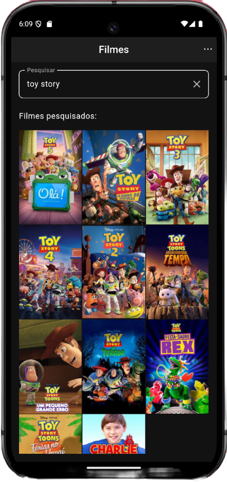
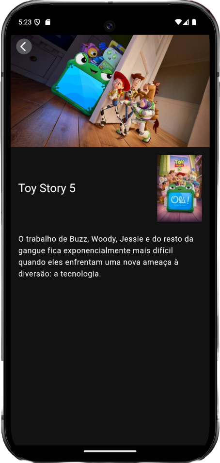

# Movie Search

A Flutter app for searching movies using the [TMDB (The Movie Database) API](https://www.themoviedb.org/). Browse the trending movies of the day, search by title, and see the details of any movie (UI in Portuguese).

## Screenshots

     


## Technical Highlights

- **Clean Architecture**: separation between domain, data and presentation layers.
- **State Management**: BLoC with event concurrency for pagination.
- **Pagination**: incremental loading of trending and search results.
- **Caching**: trending movies are cached locally per page (8h Time To Live) and movie images are cached to reduce unnecessary network requests.
- **Testing**: unit and widget tests covering core business logic and UI behavior.
- **Error Handling**: explicit error states with retry support.

## Tech Stack

- **State management**: `flutter_bloc` / `bloc` (+ `bloc_concurrency` for pagination events)
- **Networking**: `dio` with `either_dart` for typed error handling
- **Dependency injection**: `get_it`
- **Images**: `cached_network_image` + `flutter_cache_manager`
- **SVG**: `flutter_svg`
- **Tests**: `flutter_test`, `mocktail`, `bloc_test`

## Architecture

The project follows **Clean Architecture**, split into three layers:

```
lib/
├── core/            # Theme, constants (strings, sizes, keys), error types
├── data/            # Remote data source (Dio/HTTP), models, repository implementation
├── domain/          # Entities, repository contract, use cases
├── presentation/    # Screens, BLoCs, widgets, extensions
└── di/              # Service locator wiring (get_it)
```

- **domain**: pure Dart, no framework dependencies — entities (`Movie`, `PaginatedMovies`, `SearchParams`), the `MoviesRepository` contract, and use cases (`GetTrendingMoviesUseCase`, `SearchMoviesUseCase`).
- **data**: implements the repository using a `MovieDataSource` (TMDB REST API via `HttpService`) and model mappers (`MovieResponseModel`, `PaginatedMoviesResponseModel`).
- **presentation**: BLoC-driven UI. `MoviesSearchBloc` handles the search/trending/pagination events, and the screens render states (`SuccessState`, `LoadingState`, `LoadingMoreMoviesState`, `ErrorState`).

## Getting Started

### Prerequisites

- Flutter SDK (see `pubspec.yaml` for the required Dart SDK constraint)
- A TMDB API key — create a free account at https://www.themoviedb.org/settings/api

### Setup

```bash
# 1. Clone the repository
git clone git@github.com:LindseyFontana/movie_search.git
cd movie_search

# 2. Install dependencies
flutter pub get

# 3. Run the app, passing your TMDB API key
flutter run --dart-define=MOVIE_API_KEY=your_tmdb_api_key
```

> The API key is read at compile time via `String.fromEnvironment('MOVIE_API_KEY')` and is never committed to the repository.

### Running from VS Code

If you run/debug from VS Code (using the configs in `.vscode/launch.json`), the app is launched with `--dart-define-from-file .env.json`, so you need to create a `.env.json` file at the project root with your key:

```json
{
  "MOVIE_API_KEY": "your_tmdb_api_key"
}
```

> `.env.json` is already ignored by git, so your key stays out of version control. Without this file, launching via VS Code will fail with a file-not-found error.

### Running tests

```bash
flutter test
```

To check static analysis:

```bash
flutter analyze
```

## Credits

This product uses the TMDB API but is not endorsed or certified by TMDB.